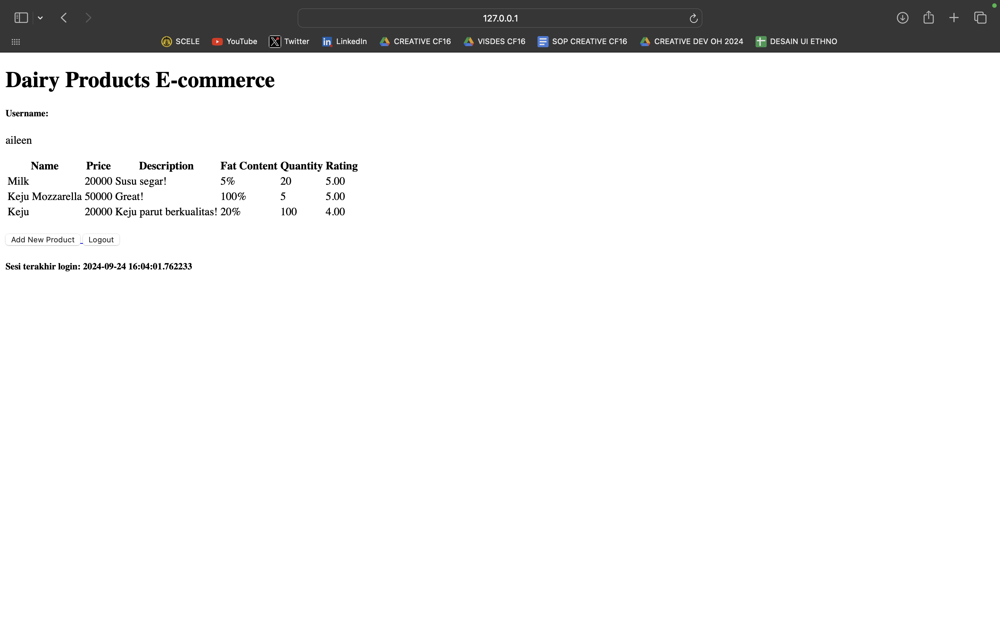
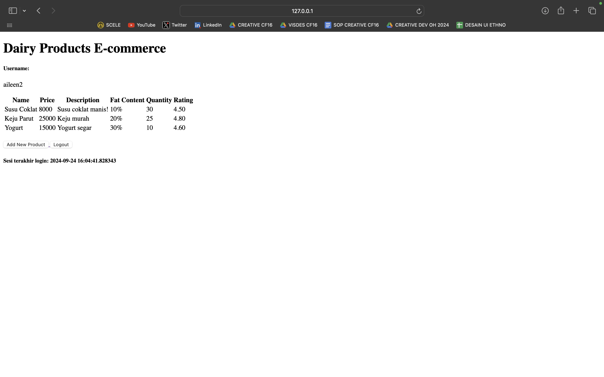

- Link Aplikasi PWS : https://aileen-josephine-dairyproductsecommerce.pbp.cs.ui.ac.id 

## Tugas 6

#### Jelaskan manfaat dari penggunaan JavaScript dalam pengembangan aplikasi web!
JavaScript adalah bahasa pemrograman yang sangat penting dalam pengembangan aplikasi web karena memungkinkan interaktivitas dan dinamisasi halaman web. Dengan JavaScript, developer dapat membuat elemen-elemen seperti form validasi, animation, dan konten yang dapat diperbarui tanpa perlu memuat ulang seluruh halaman. Hal ini meningkatkan user experience, menjadikannya lebih responsif dan menarik. Selain itu, JavaScript juga berfungsi dalam pengembangan aplikasi berbasis client-side, di mana logika dan pemrosesan dapat dilakukan langsung di browser, mengurangi beban server.

#### Jelaskan fungsi dari penggunaan await ketika kita menggunakan fetch()! Apa yang akan terjadi jika kita tidak menggunakan await?
Penggunaan await dalam konteks fetch() berfungsi untuk menunggu hasil dari operasi asynchronous sebelum melanjutkan eksekusi kode berikutnya. Ketika kita melakukan permintaan HTTP menggunakan fetch(), responsnya mungkin belum tersedia secara instan, dan await memastikan bahwa kita hanya melanjutkan eksekusi kode setelah respons diterima. Jika kita tidak menggunakan await, eksekusi kode akan melanjutkan ke pernyataan berikutnya tanpa menunggu respons, yang dapat menyebabkan error atau hasil yang tidak diinginkan, seperti mencoba mengakses data yang belum tersedia.

#### Mengapa kita perlu menggunakan decorator csrf_exempt pada view yang akan digunakan untuk AJAX POST?
Decorator csrf_exempt digunakan untuk menonaktifkan perlindungan CSRF (Cross-Site Request Forgery) pada view tertentu yang diakses melalui AJAX POST. CSRF adalah jenis serangan di mana penyerang mencoba untuk mengirim permintaan yang tidak sah atas nama pengguna yang terautentikasi. Dalam konteks AJAX, jika kita tidak mengecualikan view dari perlindungan CSRF, permintaan POST mungkin akan ditolak oleh server karena tidak menyertakan token CSRF yang valid. Dengan menggunakan decorator ini, kita memastikan bahwa view tersebut dapat diakses dengan mudah oleh permintaan AJAX, tanpa harus menangani token CSRF secara manual.

#### Pada tutorial PBP minggu ini, pembersihan data input pengguna dilakukan di belakang (backend) juga. Mengapa hal tersebut tidak dilakukan di frontend saja?
Pembersihan data input pengguna di backend adalah langkah penting untuk memastikan keamanan dan integritas aplikasi. Meskipun pembersihan bisa dilakukan di frontend untuk meningkatkan pengalaman pengguna, melakukan pembersihan di backend adalah cara yang lebih aman karena data yang diterima dari frontend dapat dimanipulasi oleh pengguna. Dengan melakukan validasi dan pembersihan di backend, kita dapat memastikan bahwa semua data yang masuk ke sistem telah diperiksa dan diolah sesuai dengan kebijakan keamanan aplikasi. Hal ini juga mencegah potensi serangan seperti SQL injection dan XSS (Cross-Site Scripting) yang dapat terjadi jika data yang tidak bersih diproses langsung.

#### Jelaskan bagaimana cara kamu mengimplementasikan checklist di atas secara step-by-step (bukan hanya sekadar mengikuti tutorial)!

AJAX GET & AJAX POST
1. Saya menambahkan kedua impor berikut pada file views.py: csrf_exempt dan require_POST.
2. Saya membuat fungsi baru pada views.py dengan nama add_product_ajax yang menerima parameter request.
3. Saya menambahkan routing untuk fungsi add_product_ajax.
4. Saya menampilkan data produk dengan menggunakan fetch() API. Saya membuka berkas views.py dan mengubah baris pertama views untuk show_json dan show_xml seperti berikut: data = Product.objects.filter(user=request.user).
5. Saya membuat block script di bagian bawah berkas dan membuat fungsi baru pada block script tersebut dengan nama getProducts dan refreshProducts yang digunakan untuk me-refresh data produk secara asinkronus.
6. Saya membuat modal sebagai form untuk menambahkan produk, mengimplementasikan modal (Tailwind) pada aplikasi saya, menambahkan fungsi showModal, hideModal, dan menambahkan tombol baru untuk melakukan penambahan data dengan AJAX.
7. Saya menambahkan data produk dengan AJAX dengan membuat fungsi addProduct. Saya menambahkan sebuah event listener pada form yang ada di modal untuk menjalankan fungsi addProduct().
8. Pada fungsi add_product_ajax di views.py, saya menggunakan fungsi strip_tags pada data fields yang ada sebelum data tersebut dimasukkan ke dalam Product. Pada class DairyEntryForm di forms.py, saya menambahkan method clean.
9. Saya membersihkan data dengan DOMPurify.

## Tugas 5

#### Jika terdapat beberapa CSS selector untuk suatu elemen HTML, jelaskan urutan prioritas pengambilan CSS selector tersebut!

Dalam CSS, urutan prioritas pengambilan selector atau spesifisitas adalah penting untuk menentukan gaya mana yang diterapkan pada elemen HTML ketika terdapat beberapa aturan yang mungkin bertentangan. Urutan prioritasnya adalah sebagai berikut:
1. Inline styles: Gaya yang ditetapkan langsung pada elemen HTML menggunakan atribut style.
2. ID selector: Selector yang menggunakan ID (misalnya, #example).
3. Class selector, attribute selector, dan pseudo-classes: Selector ini mencakup class (misalnya, .example), atribut (misalnya, [type="text"]), dan pseudo-classes (misalnya, :hover).
4. Element selector dan pseudo-elements: Selector ini mencakup nama elemen (misalnya, div, p) dan pseudo-elements (misalnya, ::before, ::after).
5. Universal selector: Selector ini menggunakan asterisk * yang menargetkan semua elemen.
Jika terdapat aturan yang memiliki spesifisitas yang sama, aturan yang muncul terakhir dalam file CSS akan diambil.

#### Mengapa responsive design menjadi konsep yang penting dalam pengembangan aplikasi web? Berikan contoh aplikasi yang sudah dan belum menerapkan responsive design!

Responsive design adalah konsep yang penting dalam pengembangan aplikasi web karena ia memastikan bahwa tampilan dan fungsionalitas suatu situs web dapat beradaptasi dengan berbagai ukuran layar dan perangkat. Ini sangat penting mengingat semakin banyaknya pengguna yang mengakses internet melalui perangkat mobile. Dengan responsive design, pengalaman pengguna menjadi lebih baik, karena konten tetap mudah diakses dan dibaca tanpa harus melakukan zoom in atau scroll horizontal. Contoh aplikasi yang sudah menerapkan responsive design adalah Twitter, yang menawarkan pengalaman pengguna yang konsisten di desktop dan perangkat mobile. Sebaliknya, situs web yang tidak responsif, seperti irishwrecksonline.net, mungkin hanya terlihat baik di layar desktop tetapi masih tidak responsif.

#### Jelaskan perbedaan antara margin, border, dan padding, serta cara untuk mengimplementasikan ketiga hal tersebut!

- Margin adalah ruang di luar elemen yang memisahkannya dari elemen lain. Ini tidak mempengaruhi ukuran elemen, dan dapat diatur menggunakan properti margin. 
- Border adalah garis yang mengelilingi elemen dan membentuk batas antara margin dan padding. Kita dapat mengatur ketebalan, gaya, dan warna border menggunakan properti border.
- Padding adalah ruang di dalam elemen, antara konten dan border. Padding menambah ukuran elemen dan dapat diatur menggunakan properti padding.
- Berikut adalah contoh cara mengimplementasikannya.

```css
.element {
    margin: 20px;              
    border: 2px solid black;   
    padding: 15px;             
}
```

```html
<div class="element">
    Ini adalah contoh elemen dengan margin, border, dan padding.
</div>
```

#### Jelaskan konsep flex box dan grid layout beserta kegunaannya!

- Flexbox adalah model layout CSS yang dirancang untuk menyediakan cara yang lebih efisien dalam mengatur dan mendistribusikan ruang di dalam kontainer, terutama ketika ukuran elemen tidak diketahui dan dapat berubah. Flexbox memungkinkan elemen anak dalam kontainer untuk disusun secara horizontal atau vertikal dengan mudah, memberikan kontrol atas aliran, perataan, dan ukuran.
- Grid Layout adalah model layout dua dimensi yang memungkinkan penataan elemen dalam baris dan kolom. Dengan grid, kita dapat membuat tata letak kompleks dengan lebih mudah dan lebih terstruktur, dan juga dapat mengatur elemen dalam grid menggunakan baris dan kolom dengan properti seperti grid-template-columns dan grid-template-rows.
- Kegunaan keduanya terletak pada kemudahan dalam menciptakan layout yang responsif dan dinamis. Flexbox lebih cocok untuk desain satu dimensi, sementara Grid lebih cocok untuk desain dua dimensi.

#### Jelaskan bagaimana cara kamu mengimplementasikan checklist di atas secara step-by-step (bukan hanya sekadar mengikuti tutorial)!

1. Implementasikan fungsi untuk menghapus dan mengedit product.
- Saya membuka file views.py dan menambahkan fungsi edit_product dan delete_product.
- Pada fungsi edit_product, saya mengambil data produk berdasarkan ID yang diterima, kemudian membuat form untuk mengedit informasi produk tersebut. Setelah user mengisi form, saya menyimpan perubahan ke database.
- Untuk fungsi delete_product, saya mengambil produk berdasarkan ID dan menghapusnya dari database. 

2. Kustomisasi desain pada template HTML yang telah dibuat pada tugas-tugas sebelumnya menggunakan CSS atau CSS framework (seperti Bootstrap, Tailwind, Bulma) dengan ketentuan sebagai berikut:
    * Kustomisasi halaman login, register, dan tambah product semenarik mungkin.
        - Saya mengubah tampilan halaman login dan register dengan menambahkan elemen-elemen menarik menggunakan Tailwind, seperti warna latar belakang, padding, dan efek hover pada tombol.
        - Saya memastikan bahwa form pada halaman tersebut mudah diakses dan responsif, dengan mengatur lebar maksimum dan margin yang sesuai.

    * Kustomisasi halaman daftar product menjadi lebih menarik dan responsive.
        - Saya mengubah tampilan halaman daftar produk agar lebih menarik dan responsif. Jika belum ada produk yang tersimpan, saya menampilkan gambar dan pesan bahwa belum ada produk yang terdaftar.
        - Jika produk sudah ada, saya menggunakan card untuk menampilkan setiap produk dengan detailnya, termasuk nama, harga, deskripsi, fat content, quantity, dan rating.

    * Untuk setiap card product, buatlah dua buah button untuk mengedit dan menghapus product pada card tersebut!
        - Saya menambahkan dua tombol pada setiap card produk: satu untuk mengedit produk dan satu untuk menghapus produk. Tombol-tombol ini terhubung ke fungsi yang sesuai di views.py, sehingga pengguna bisa melakukan tindakan langsung dari halaman daftar produk.

    * Buatlah navigation bar (navbar) untuk fitur-fitur pada aplikasi yang responsive terhadap perbedaan ukuran device, khususnya mobile dan desktop.
        - Saya membuat file baru bernama navbar.html dan menambahkan elemen navbar yang responsif menggunakan tailwind. Navbar ini berisi tautan ke berbagai fitur aplikasi, seperti daftar produk, tambah produk, dan logout.
        - Saya menyertakan navbar.html ke dalam semua template utama seperti main.html, create_product.html, dan edit_product.html menggunakan tag , sehingga navbar terlihat konsisten.

## Tugas 4

#### Apa perbedaan antara HttpResponseRedirect() dan redirect()

HttpResponseRedirect() adalah fungsi yang digunakan untuk mengembalikan respons pengalihan (redirect) secara manual dengan memberikan URL tujuan. Sementara itu, redirect() adalah shortcut di Django yang secara otomatis membuatkan HttpResponseRedirect() untuk kita. Dengan redirect(), kita bisa memberikan URL, nama view, atau objek, dan Django akan mengonversinya ke URL secara otomatis.

#### Jelaskan cara kerja penghubungan model Product dengan User!

Untuk menghubungkan model Product dengan User, biasanya digunakan ForeignKey pada model Product. ForeignKey ini menunjukkan bahwa setiap produk dimiliki oleh satu pengguna. Misalnya, dalam Django, kita bisa menambahkan atribut user = models.ForeignKey(User, on_delete=models.CASCADE) di model Product, yang mengaitkan setiap produk ke pengguna yang membuatnya.

#### Apa perbedaan antara authentication dan authorization, apakah yang dilakukan saat pengguna login? Jelaskan bagaimana Django mengimplementasikan kedua konsep tersebut.

Authentication (otentikasi) adalah proses memverifikasi identitas pengguna, seperti memasukkan username dan password. Authorization (otorisasi) adalah proses mengecek apakah pengguna yang sudah terverifikasi punya izin untuk mengakses fitur atau sumber daya tertentu. Saat pengguna login, mereka menjalani proses otentikasi untuk memastikan bahwa mereka adalah pengguna yang sah. Django mengimplementasikan kedua konsep ini dengan sistem authentication framework yang mencakup login() dan logout() untuk otentikasi, serta sistem izin (permissions) dan grup (groups) untuk otorisasi.

#### Bagaimana Django mengingat pengguna yang telah login? Jelaskan kegunaan lain dari cookies dan apakah semua cookies aman digunakan?

Django mengingat pengguna yang sudah login dengan menggunakan session dan cookies. Saat pengguna login, Django menyimpan informasi tentang pengguna di sesi, yang kemudian diidentifikasi menggunakan cookie yang disimpan di browser pengguna. Selain itu, cookies dapat digunakan untuk menyimpan preferensi pengguna atau informasi pelacakan. Namun, tidak semua cookies aman digunakan karena ada risiko keamanan seperti cross-site scripting (XSS) atau session hijacking. Untuk mengurangi risiko, Django mendukung penggunaan secure cookies dan HttpOnly cookies.

#### Jelaskan bagaimana cara kamu mengimplementasikan checklist di atas secara step-by-step (bukan hanya sekadar mengikuti tutorial).

1. Mengimplementasikan fungsi registrasi, login, dan logout untuk memungkinkan pengguna untuk mengakses aplikasi sebelumnya dengan lancar.
- Saya mulai dengan membuat form untuk registrasi menggunakan UserCreationForm dari Django.
- Lalu, saya tambahkan view untuk registrasi, login, dan logout dengan membuat fungsi register(), login(), dan logout() di views.py.
- Selanjutnya, saya gunakan django.contrib.auth untuk mengatur autentikasi dan implementasikan login dan logout dengan fungsi login() dan logout().
- Saya buat URL routing di urls.py untuk mengakses halaman login, registrasi, dan logout.
- Terakhir, saya buat template HTML untuk form login dan registrasi, dan tambahkan tombol logout di header aplikasi.

2. Membuat dua akun pengguna dengan masing-masing tiga dummy data menggunakan model yang telah dibuat pada aplikasi sebelumnya untuk setiap akun di lokal.
- Saya mulai dengan menjalankan aplikasi di localhost, lalu membuka halaman registrasi yang sudah dibuat sebelumnya.
- Lalu, saya buat dua akun pengguna baru langsung melalui form registrasi di web.
- Setelah kedua akun terdaftar, saya login dengan masing-masing akun dan menambahkan tiga data dummy Product untuk setiap akun.




3. Menghubungkan model Product dengan User.
- Saya pergi ke model Product dan menambahkan ForeignKey yang menghubungkan Product dengan User. Saya buat atribut user = models.ForeignKey(User, on_delete=models.CASCADE).
- Setelah itu, saya jalankan migrasi dengan perintah python manage.py makemigrations dan python manage.py migrate untuk memperbarui skema database agar sesuai dengan perubahan.
- Saya juga memperbarui view yang menampilkan produk agar hanya menampilkan produk milik pengguna yang sedang login, dengan menggunakan query Product.objects.filter(user=request.user).

4. Menampilkan detail informasi pengguna yang sedang logged in seperti username dan menerapkan cookies seperti last login pada halaman utama aplikasi.
- Di template halaman utama, saya tambahkan kode untuk menampilkan username pengguna yang sedang login dengan {{ name }}.
- Untuk cookies, saya perhatikan bahwa Django secara otomatis menyimpan informasi last login dalam cookies pengguna.
- Lalu, saya akses informasi ini di view atau template dan menampilkan last login di halaman utama dengan menggunakan {{ last_login }}.

## Tugas 3

#### Jelaskan mengapa kita memerlukan data delivery dalam pengimplementasian sebuah platform

Data delivery penting dalam pengimplementasian sebuah aplikasi karena memungkinkan transfer data antara server dan client secara efisien. Hal ini memastikan aplikasi dapat memberikan response yang sesuai terhadap permintaan pengguna seperti mengirim data dari server ke browser (client) untuk menampilkan informasi atau menerima data input dari pengguna untuk diproses.

#### Menurutmu, mana yang lebih baik antara XML dan JSON? Mengapa JSON lebih populer dibandingkan XML?

Menurut saya, JSON lebih baik karena lebih muda dibaca dan ditulis serta ukuran filenya yang lebih kecil. Namun, sepertinya browser tidak dapat menampilkan JSON yang diformat dengan baik, sedangkan XML bisa. Walaupun demikian, JSON tetap lebih unggul karena syntaxnya yang lebih mirip dengan bahasa pemrograman, misalnya Java atau Javascript, dibandingkan dengan syntax XML yang mirip seperti HTML.

#### Jelaskan fungsi dari method is_valid() pada form Django dan mengapa kita membutuhkan method tersebut?
Method is_valid() pada form Django digunakan untuk memeriksa apakah data yang dikirimkan dalam form sudah valid yang telah ditentukan. Fungsi ini sangat penting karena is_valid() memastikan bahwa data yang diinput sesuai dengan aturan yang telah ditentukan, seperti format email yang benar, panjang teks, input berupa angka, atau apakah suatu field wajib diisi. Dengan memvalidasi data, kita juga dapat mencegah data yang tidak diinginkan.

Jika is_valid() mereturn False, maka form tersebut dianggap tidak valid dan kita bisa memberikan error message kepada pengguna.

#### Mengapa kita membutuhkan csrf_token saat membuat form di Django? Apa yang dapat terjadi jika kita tidak menambahkan csrf_token pada form Django? Bagaimana hal tersebut dapat dimanfaatkan oleh penyerang?

csrf_token dibutuhkan untuk mencegah serangan Cross-Site Request Forgery (CSRF). Jika kita tidak menggunakan csrf_token, maka aplikasi kita bisa rentan terhadap serangan CSRF. Hacker bisa membuat halaman berbahaya yang menyertakan form tersembunyi dan ketika pengguna mengunjungi halaman tersebut, form tersebut secara otomatis dikirimkan ke server aplikasi web target, lalu menyebabkan perubahan yang tidak sah pada data pengguna. 

####  Jelaskan bagaimana cara kamu mengimplementasikan checklist di atas secara step-by-step (bukan hanya sekadar mengikuti tutorial).

1. Membuat input form untuk menambahkan objek model pada app sebelumnya.
- Saya pertama-tama menambahkan /templates dan base.html untuk membuat base HTML
- Kemudian, saya membuat create_product.html untuk membuat form dan juga memodifikasi main.html untuk menginclude form tersebut
- Lalu, saya membuat forms.py dan membuat Class agar form tesebut bisa menerima dan menyimpan datanya
- Saya juga memodifikasi models.py saya agar memiliki id
- Kemudian, saya memodifikasi views.py agak bisa menerima POST Request dari form yang barusan saya buat, sekaligus juga agar bisa menampilkan main.html

2. Tambahkan 4 fungsi views baru untuk melihat objek yang sudah ditambahkan dalam format XML, JSON, XML by ID, dan JSON by ID.

- Saya menambahkan 4 fungsi berikut pada views.py

```python
# mengembalikan data dalam bentuk xml
def show_xml(request):
    data = Product.objects.all()
    return HttpResponse(serializers.serialize("xml", data), content_type="application/xml")

# mengembalikan data dalam bentuk json
def show_json(request):
    data = Product.objects.all()
    return HttpResponse(serializers.serialize("json", data), content_type="application/json")

# mengembalikan data dalam bentuk xml, mengambilnya berdasarkan id
def show_xml_by_id(request, id):
    data = Product.objects.filter(pk=id)
    return HttpResponse(serializers.serialize("xml", data), content_type="application/xml")

# mengembalikan data dalam bentuk json, mengambilnya berdasarkan id
def show_json_by_id(request, id):
    data = Product.objects.filter(pk=id)
    return HttpResponse(serializers.serialize("json", data), content_type="application/json")
```

3. Membuat routing URL untuk masing-masing views yang telah ditambahkan pada poin 2.

- Saya menambahkan routing pada urls.py seperti berikut:

```python
from django.urls import path
from main.views import show_main, create_product, show_xml, show_json, show_xml_by_id, show_json_by_id

app_name = 'main'

urlpatterns = [
    path('', show_main, name='show_main'),
    path('create-product', create_product, name='create_product'),
    
    path('xml/', show_xml, name='show_xml'),
    path('json/', show_json, name='show_json'),
    path('xml/<str:id>/', show_xml_by_id, name='show_xml_by_id'),
    path('json/<str:id>/', show_json_by_id, name='show_json_by_id'),
]
```

### Sceenshots
#### `/xml`


#### `/json`


#### `/xml/<id>`


#### `/json/<id>`


## Tugas 2
- Jelaskan bagaimana cara kamu mengimplementasikan checklist di atas secara step-by-step (bukan hanya sekadar mengikuti tutorial).

1.  Membuat sebuah proyek Django baru.
> Saya membuat proyek Django dengan nama dairy-products-ecommerce.
> Lalu, saya membuka terminal dan berpindah ke direktori yang sudah disiapkan untuk proyek.
> Saya menjalankan perintah django-admin startproject dairy_products_ecommerce untuk membuat struktur dasar proyek Django.

2. Membuat aplikasi dengan nama main pada proyek tersebut.
> Saya tetap berada di direktori proyek dan membuat aplikasi baru bernama main menggunakan perintah python manage.py startapp main.
> Django kemudian membuat struktur awal aplikasi, termasuk folder migrations, views.py, models.py, dan lainnya.

3. Melakukan routing pada proyek agar dapat menjalankan aplikasi main.
> Saya membuka file settings.py pada direktori proyek utama (dairy_products_ecommerce) dan menambahkan 'main' ke dalam daftar INSTALLED_APPS untuk memberitahu Django bahwa aplikasi ini aktif.
> Saya membuka file urls.py pada direktori proyek utama dan menambahkan rute untuk aplikasi main dengan cara path('main/', include('main.urls')), agar aplikasi ini bisa diakses melalui URL.

4. Membuat model pada aplikasi main dengan nama Product dan memiliki atribut wajib sebagai berikut. (name, price, description)
> Saya membuka file models.py pada aplikasi main.
> Saya membuat model Product yang memiliki atribut name, price, dan description sesuai dengan kebutuhan. Saya juga menambahkan atribut tambahan seperti fat content, quantity, dan rating.
> Setelah membuat model, saya menjalankan perintah python manage.py makemigrations dan python manage.py migrate untuk membuat dan menerapkan perubahan database.

5. Membuat sebuah fungsi pada views.py untuk dikembalikan ke dalam sebuah template HTML yang menampilkan nama aplikasi serta nama dan kelas kamu.
> Saya membuka file views.py di aplikasi main.
> Saya membuat fungsi show_main yang akan mengembalikan template HTML dengan data seperti nama aplikasi, nama saya, dan kelas saya.
> Di dalam fungsi ini, saya menggunakan render untuk menampilkan template dengan data yang dikirimkan.

6. Membuat sebuah routing pada urls.py aplikasi main untuk memetakan fungsi yang telah dibuat pada views.py.
> Saya membuat file urls.py di dalam folder aplikasi main.
> Saya menambahkan rute baru dengan path('', show_main, name='show_main') untuk menghubungkan URL ke fungsi show_main yang telah dibuat di views.py.

7. Melakukan deployment ke PWS terhadap aplikasi yang sudah dibuat sehingga nantinya dapat diakses oleh teman-temanmu melalui Internet.
> Setelah semua bagian selesai, saya membuka terminal dan melakukan commit semua perubahan ke Git.
> Saya melakukan deploy aplikasi ke PWSdengan mengikuti prosedur deployment yang sesuai.
> Setelah berhasil deploy, saya menguji aplikasi melalui browser untuk memastikan aplikasi bisa diakses secara online.

- Buatlah bagan yang berisi request client ke web aplikasi berbasis Django beserta responnya dan jelaskan pada bagan tersebut kaitan antara urls.py, views.py, models.py, dan berkas html.
Berikut adalah link bagannya : https://drive.google.com/file/d/14ILUORqEUW764DEfm-vm_n9y9uN6xlh7/view?usp=sharing 

- Jelaskan fungsi git dalam pengembangan perangkat lunak!
Fungsi git adalah untuk mengelola versi kode, berkolaborasi antar pengembang, melacak perubahan, dan memperbaiki kesalahan. Git mempermudah pengelolaan proyek secara aman dan terstruktur.

- Menurut Anda, dari semua framework yang ada, mengapa framework Django dijadikan permulaan pembelajaran pengembangan perangkat lunak?
Django dipilih sebagai framework permulaan pembelajaran pengembangan perangkat lunak karena kemudahan penggunaannya, fitur built-in yang lengkap, dan struktur yang jelas mengikuti pola Model-View-Template (MVT). Django memungkinkan pemula untuk membangun aplikasi web dengan cepat dan aman sambil memahami konsep arsitektur dan praktik pengembangan yang baik.

- Mengapa model pada Django disebut sebagai ORM?
Model Django disebut ORM (Object-Relational Mapping) karena menghubungkan objek Python dengan tabel di database, memungkinkan pengembang untuk melakukan operasi database (seperti membuat, membaca, memperbarui, dan menghapus data) menggunakan objek Python, tanpa perlu menulis SQL secara langsung.
