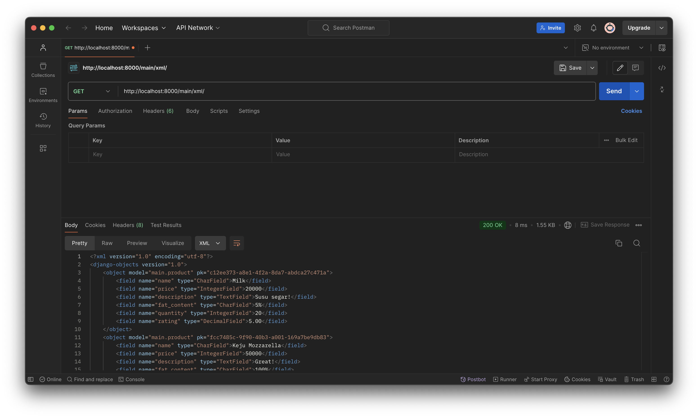
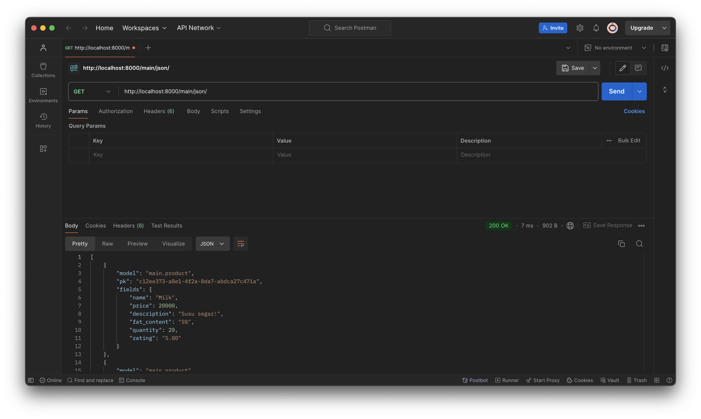
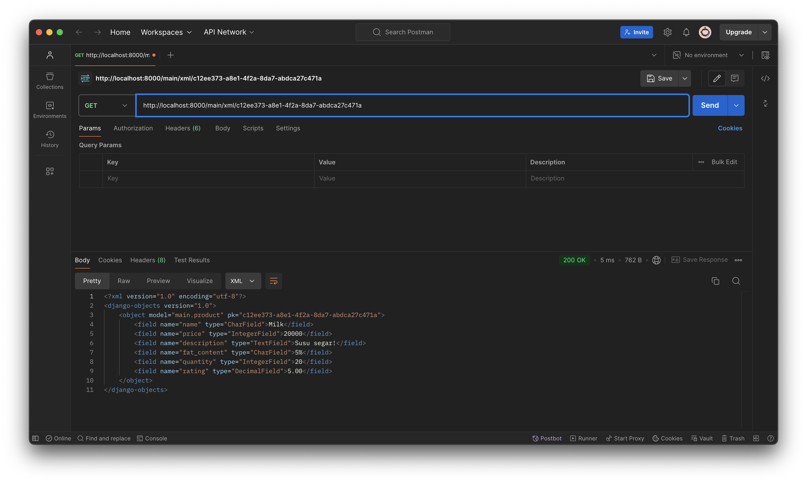
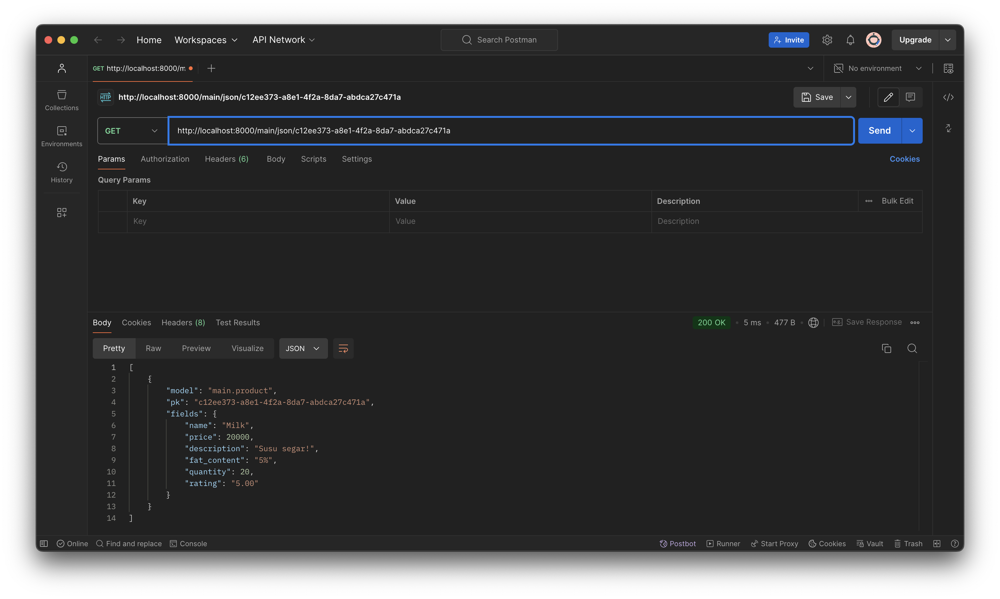

- Link Aplikasi PWS : https://aileen-josephine-dairyproductsecommerce.pbp.cs.ui.ac.id 

## Tugas 3

#### Jelaskan mengapa kita memerlukan data delivery dalam pengimplementasian sebuah platform

Data delivery penting dalam pengimplementasian sebuah aplikasi karena memungkinkan transfer data antara server dan client secara efisien. Hal ini memastikan aplikasi dapat memberikan response yang sesuai terhadap permintaan pengguna seperti mengirim data dari server ke browser (client) untuk menampilkan informasi atau menerima data input dari pengguna untuk diproses.

#### Menurutmu, mana yang lebih baik antara XML dan JSON? Mengapa JSON lebih populer dibandingkan XML?

Menurut saya, JSON lebih baik karena lebih muda dibaca dan ditulis serta ukuran filenya yang lebih kecil. Namun, sepertinya browser tidak dapat menampilkan JSON yang diformat dengan baik, sedangkan XML bisa. Walaupun demikian, JSON tetap lebih unggul karena syntaxnya yang lebih mirip dengan bahasa pemrograman, misalnya Java atau Javascript, dibandingkan dengan syntax XML yang mirip seperti HTML.

#### Jelaskan fungsi dari method is_valid() pada form Django dan mengapa kita membutuhkan method tersebut?
Method is_valid() pada form Django digunakan untuk memeriksa apakah data yang dikirimkan dalam form sudah valid yang telah ditentukan. Fungsi ini sangat penting karena is_valid() memastikan bahwa data yang diinput sesuai dengan aturan yang telah ditentukan, seperti format email yang benar, panjang teks, input berupa angka, atau apakah suatu field wajib diisi. Dengan memvalidasi data, kita juga dapat mencegah data yang tidak diinginkan.

Jika is_valid() mereturn False, maka form tersebut dianggap tidak valid dan kita bisa memberikan error message kepada pengguna.

#### Mengapa kita membutuhkan csrf_token saat membuat form di Django? Apa yang dapat terjadi jika kita tidak menambahkan csrf_token pada form Django? Bagaimana hal tersebut dapat dimanfaatkan oleh penyerang?

csrf_token dibutuhkan untuk mencegah serangan Cross-Site Request Forgery (CSRF). Jika kita tidak menggunakan csrf_token, maka aplikasi kita bisa rentan terhadap serangan CSRF. Hacker bisa membuat halaman berbahaya yang menyertakan form tersembunyi dan ketika pengguna mengunjungi halaman tersebut, form tersebut secara otomatis dikirimkan ke server aplikasi web target, lalu menyebabkan perubahan yang tidak sah pada data pengguna. 

####  Jelaskan bagaimana cara kamu mengimplementasikan checklist di atas secara step-by-step (bukan hanya sekadar mengikuti tutorial).

1. Membuat input form untuk menambahkan objek model pada app sebelumnya.
- Saya pertama-tama menambahkan /templates dan base.html untuk membuat base HTML
- Kemudian, saya membuat create_product.html untuk membuat form dan juga memodifikasi main.html untuk menginclude form tersebut
- Lalu, saya membuat forms.py dan membuat Class agar form tesebut bisa menerima dan menyimpan datanya
- Saya juga memodifikasi models.py saya agar memiliki id
- Kemudian, saya memodifikasi views.py agak bisa menerima POST Request dari form yang barusan saya buat, sekaligus juga agar bisa menampilkan main.html

2. Tambahkan 4 fungsi views baru untuk melihat objek yang sudah ditambahkan dalam format XML, JSON, XML by ID, dan JSON by ID.

- Saya menambahkan 4 fungsi berikut pada views.py

```python
# mengembalikan data dalam bentuk xml
def show_xml(request):
    data = Product.objects.all()
    return HttpResponse(serializers.serialize("xml", data), content_type="application/xml")

# mengembalikan data dalam bentuk json
def show_json(request):
    data = Product.objects.all()
    return HttpResponse(serializers.serialize("json", data), content_type="application/json")

# mengembalikan data dalam bentuk xml, mengambilnya berdasarkan id
def show_xml_by_id(request, id):
    data = Product.objects.filter(pk=id)
    return HttpResponse(serializers.serialize("xml", data), content_type="application/xml")

# mengembalikan data dalam bentuk json, mengambilnya berdasarkan id
def show_json_by_id(request, id):
    data = Product.objects.filter(pk=id)
    return HttpResponse(serializers.serialize("json", data), content_type="application/json")
```

3. Membuat routing URL untuk masing-masing views yang telah ditambahkan pada poin 2.

- Saya menambahkan routing pada urls.py seperti berikut:

```python
from django.urls import path
from main.views import show_main, create_product, show_xml, show_json, show_xml_by_id, show_json_by_id

app_name = 'main'

urlpatterns = [
    path('', show_main, name='show_main'),
    path('create-product', create_product, name='create_product'),
    
    path('xml/', show_xml, name='show_xml'),
    path('json/', show_json, name='show_json'),
    path('xml/<str:id>/', show_xml_by_id, name='show_xml_by_id'),
    path('json/<str:id>/', show_json_by_id, name='show_json_by_id'),
]
```

### Sceenshots
#### `/xml`



#### `/json`



#### `/xml/<id>`



#### `/json/<id>`




## Tugas 2
- Jelaskan bagaimana cara kamu mengimplementasikan checklist di atas secara step-by-step (bukan hanya sekadar mengikuti tutorial).

1.  Membuat sebuah proyek Django baru.
> Saya membuat proyek Django dengan nama dairy-products-ecommerce.
> Lalu, saya membuka terminal dan berpindah ke direktori yang sudah disiapkan untuk proyek.
> Saya menjalankan perintah django-admin startproject dairy_products_ecommerce untuk membuat struktur dasar proyek Django.

2. Membuat aplikasi dengan nama main pada proyek tersebut.
> Saya tetap berada di direktori proyek dan membuat aplikasi baru bernama main menggunakan perintah python manage.py startapp main.
> Django kemudian membuat struktur awal aplikasi, termasuk folder migrations, views.py, models.py, dan lainnya.

3. Melakukan routing pada proyek agar dapat menjalankan aplikasi main.
> Saya membuka file settings.py pada direktori proyek utama (dairy_products_ecommerce) dan menambahkan 'main' ke dalam daftar INSTALLED_APPS untuk memberitahu Django bahwa aplikasi ini aktif.
> Saya membuka file urls.py pada direktori proyek utama dan menambahkan rute untuk aplikasi main dengan cara path('', include('main.urls')), agar aplikasi ini bisa diakses melalui URL.

4. Membuat model pada aplikasi main dengan nama Product dan memiliki atribut wajib sebagai berikut. (name, price, description)
> Saya membuka file models.py pada aplikasi main.
> Saya membuat model Product yang memiliki atribut name, price, dan description sesuai dengan kebutuhan. Saya juga menambahkan atribut tambahan seperti fat content, quantity, dan rating.
> Setelah membuat model, saya menjalankan perintah python manage.py makemigrations dan python manage.py migrate untuk membuat dan menerapkan perubahan database.

5. Membuat sebuah fungsi pada views.py untuk dikembalikan ke dalam sebuah template HTML yang menampilkan nama aplikasi serta nama dan kelas kamu.
> Saya membuka file views.py di aplikasi main.
> Saya membuat fungsi show_main yang akan mengembalikan template HTML dengan data seperti nama aplikasi, nama saya, dan kelas saya.
> Di dalam fungsi ini, saya menggunakan render untuk menampilkan template dengan data yang dikirimkan.

6. Membuat sebuah routing pada urls.py aplikasi main untuk memetakan fungsi yang telah dibuat pada views.py.
> Saya membuat file urls.py di dalam folder aplikasi main jika belum ada.
> Saya menambahkan rute baru dengan path('', views.show_main) untuk menghubungkan URL ke fungsi show_main yang telah dibuat di views.py.

7. Melakukan deployment ke PWS terhadap aplikasi yang sudah dibuat sehingga nantinya dapat diakses oleh teman-temanmu melalui Internet.
> Setelah semua bagian selesai, saya membuka terminal dan melakukan commit semua perubahan ke Git.
> Saya melakukan deploy aplikasi ke PWSdengan mengikuti prosedur deployment yang sesuai.
> Setelah berhasil deploy, saya menguji aplikasi melalui browser untuk memastikan aplikasi bisa diakses secara online.

- Buatlah bagan yang berisi request client ke web aplikasi berbasis Django beserta responnya dan jelaskan pada bagan tersebut kaitan antara urls.py, views.py, models.py, dan berkas html.
Berikut adalah link bagannya : https://drive.google.com/file/d/14ILUORqEUW764DEfm-vm_n9y9uN6xlh7/view?usp=sharing 

- Jelaskan fungsi git dalam pengembangan perangkat lunak!
Fungsi git adalah untuk mengelola versi kode, berkolaborasi antar pengembang, melacak perubahan, dan memperbaiki kesalahan. Git mempermudah pengelolaan proyek secara aman dan terstruktur.

- Menurut Anda, dari semua framework yang ada, mengapa framework Django dijadikan permulaan pembelajaran pengembangan perangkat lunak?
Django dipilih sebagai framework permulaan pembelajaran pengembangan perangkat lunak karena kemudahan penggunaannya, fitur built-in yang lengkap, dan struktur yang jelas mengikuti pola Model-View-Template (MVT). Django memungkinkan pemula untuk membangun aplikasi web dengan cepat dan aman sambil memahami konsep arsitektur dan praktik pengembangan yang baik.

- Mengapa model pada Django disebut sebagai ORM?
Model Django disebut ORM (Object-Relational Mapping) karena menghubungkan objek Python dengan tabel di database, memungkinkan pengembang untuk melakukan operasi database (seperti membuat, membaca, memperbarui, dan menghapus data) menggunakan objek Python, tanpa perlu menulis SQL secara langsung.